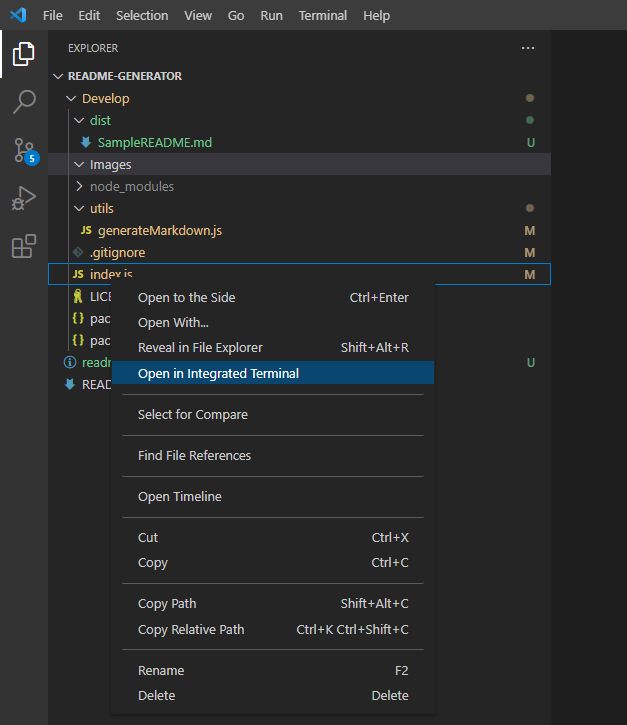
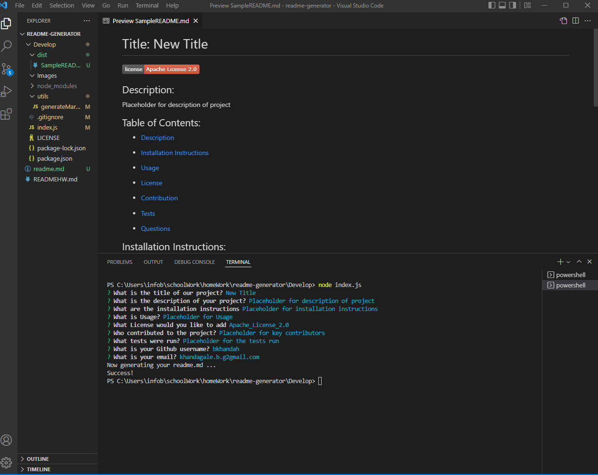
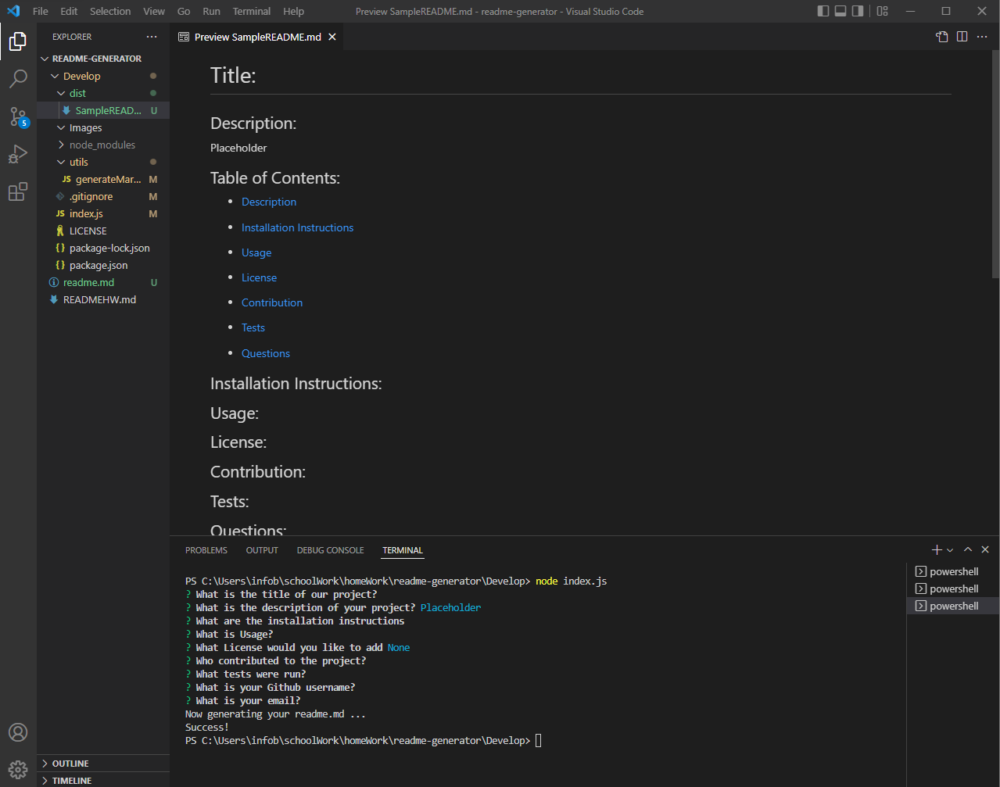

# README.md Generator

## Description:
A readme file is generated when "node index.js" command is called in the terminal window. This is done by asking a series of questions to the user. The responses provided by user are used to create contents of the readme file.

## Table of Contents:

-  [Description](#description)

-  [Installation Instructions](#installation)

-  [Video](#video)

-  [Screenshots](#screenshot)

-  [Example](#example)

-  [Questions](questions)

## Installation Instructions:
* The `.gitignore` file includes `node_modules/` and `.DS_Store/`

* Repo includes a `package.json` with the required dependencies. This is done by running `npm init` when the program is first set up.

## Video:

## Screenshots:

## Example:
The example/sample readme files can be found at ./develop./dist folder

## Questions:
For additional questions, reach out to me:

Github: https://github.com/bkhandag

Email: khandagale.b.g@gmail.com

